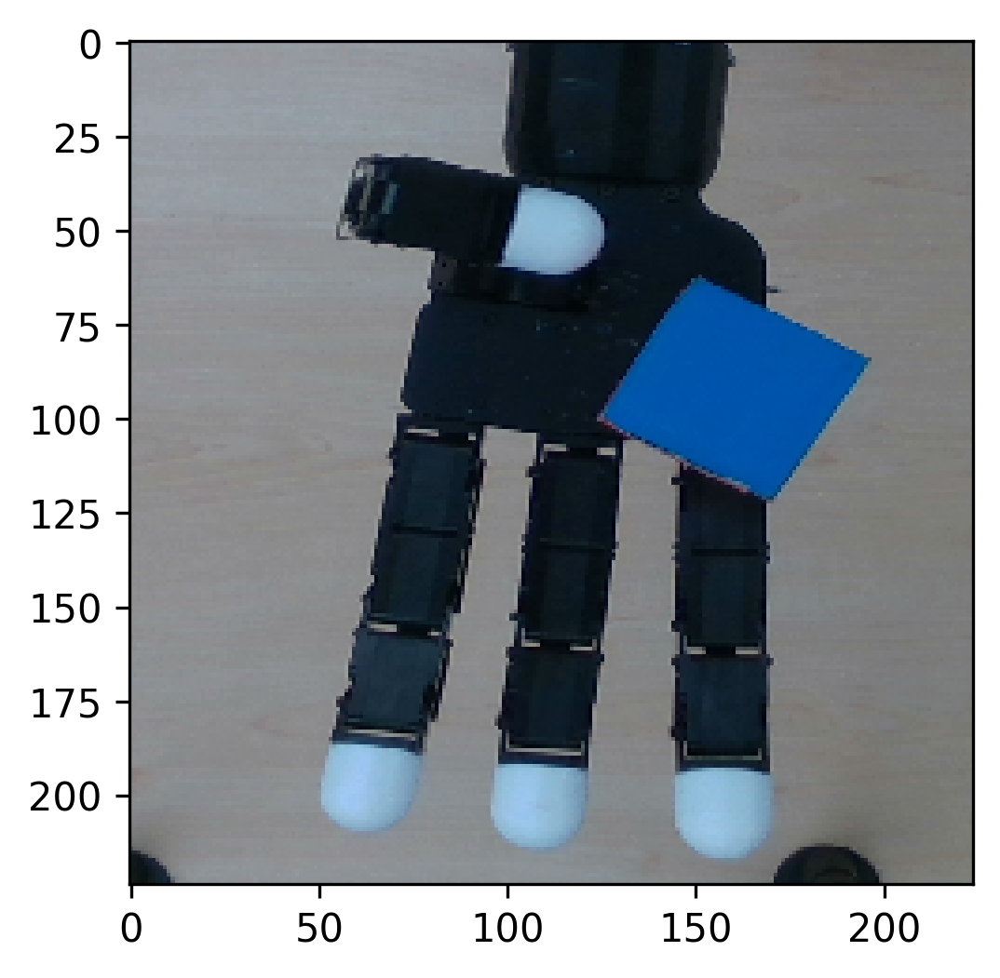
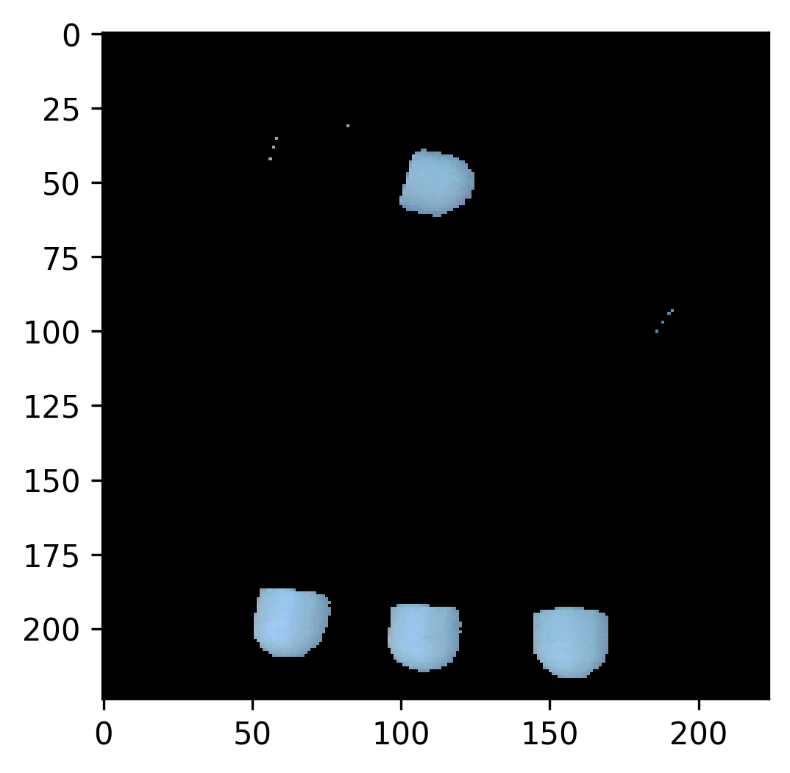

# CSCI-UA 473 : Intro to Machine Learning - Final Project

## Method

### Device Information

The project was done using Google Colab, which has NVIDIA A100-SXM4-40GB GPU and 89GB RAM.

### Data Preprocessing

The train and test sets were downloaded from the Kaggle competition (non-lazy-loading version). The train data had $3396$ entries, and the test data had $849$ entries.

The train data was then split into a $70\%$ train set and a $30\%$ validation set. The new train set had $2377$ entries, and the validation set had $1019$ entries.

Below is a basic profiling of the train/validation/test sets used:

```
----- Total Train Size: 3396 -----

Shape of train_X rgb_images: torch.Size([2377, 3, 3, 224, 224])
Shape of train_X depth_images: torch.Size([2377, 3, 224, 224])
Length of train_X file_ids: 2377 

Shape of train_Y: torch.Size([2377, 12]) 

Shape of val_X rgb_images: torch.Size([1019, 3, 3, 224, 224])
Shape of val_X depth_images: torch.Size([1019, 3, 224, 224])
Length of val_X file_ids: 1019 

Shape of val_Y: torch.Size([1019, 12]) 

----- Total Test Size: 849 -----

Shape of test_X rgb_images: torch.Size([849, 3, 3, 224, 224])
Shape of test_X depth_images: torch.Size([849, 3, 224, 224])
Length of test_X file_ids: 849
```

### Creating a Custom Dataset

The custom dataset used only top-view images.

The input X contained $2$ types of images: RGB images with shape $(3, H, W)$ and depth images with shape $(H, W)$.

The custom dataset first conducted a series of pixel operations to change the color of the table and cube to black $(0, 0, 0)$. The result RGB image will only have robot fingertips as the only light-colored elements. It then transformed RGB images by dividing all values by $255.0$, scaling the values to range $[0.0, 1.0]$. It is worth noting that no normalization was done for the RGB image. The reasons behind this will be discussed in later sections.

<figure>
    <div>
    	
        
    </div>
    <figcaption align = "center">
        <b>A Sample RGB Image Before and After Transformations</b>
    </figcaption>
</figure>

Next, it transformed the depth images by expanding their dimension at axis $0$. The transformed depth images had shape $(1, H, W)$. It then divided all values by $1000.0$ and normalized them based on the train set's mean and standard deviation of the depth values.

Finally, it combined the RGB image and depth image into a new RGBD image with shape $(4, H, W)$ and the 4 channels being $(R, G, B, D)$.

Calling `__getitem__` will return an RGBD image and corresponding robot states with shape $(12,)$.

### Initialize DataLoader

Three `DataLoader`s were initialized for the train/validation/test sets. Each `DataLoader` used $2$ workers. The train/validation `DataLoader`s had batch size $32$ and shuffling enabled. The test `DataLoader` had batch size $1$ and shuffling disabled.

### Transfer Learning

A `ResNet50` pre-trained using `IMAGENET1K_V2` was selected as the pre-trained model.

The `ResNet50` model had default input shape $(3, 224, 224)$. However, our constructed RGBD images contained $4$ channels, and our output states had shape $(12,)$. Hence, we must first make some modifications to the pre-trained model.

1. the first convolution layer was changed to `Conv2d(4, 64, kernel_size=7, stride=2, padding=3, bias=False)`;
2. the first convolution layer's weight's dimension was also expanded by $1$, and values in the new dimension was set to the values of the first dimension;

    ```python
    weight = model.conv1.weight.data.clone()
    with torch.no_grad():
        model.conv1.weight.data[:, :3] = weight
        model.conv1.weight.data[:, 3] = model.conv1.weight.data[:, 0]
    ```

3. the number of the output classes was set to $12$.

   ```
   num_ftrs = model.fc.in_features
   model.fc = nn.Linear(num_ftrs, train_states.size(0))
   ```

I used `nn.MSELoss()` as the criterion (RMSE was calculated by taking the square root of MSE),`SGD(model.parameters(), lr=0.1, momentum=0.9)` as the optimizer, and `StepLR(optimizer_ft, step_size=50, gamma=0.1)` as the scheduler.

The pre-trained model was then trained for $300$ epochs. In each epoch, there were a training phase and an evaluation phase.

At the end of each evaluation phase, the current validation loss was compared to the best validation loss so far.

If the current validation loss is lower than the best validation loss so far, the best validation loss will be updated to the current validation loss, and the current model weights will be saved.

Finally, final model's weights were restored to the weights that generated the best validation loss.

### Generate Output

The output was generated using the [sample codes](https://campuspro-uploads.s3.us-west-2.amazonaws.com/6c251796-3233-438a-8cca-69b700b79782/aa163af3-7ff3-4ff5-afc2-df5915d71152/submission.py) provided.

## Experimental Results

The best validation RMSE was $0.00320$, which occurred at Epoch $194$. The learning rate at epoch 194 was $0.0001$, and the training loss was $0.00117$.

The final test RMSE generated by Kaggle was $0.00337$, using model weights at Epoch $194$.

## Discussions

This section will discuss a few factors influencing the final outcome.

### Normalization

In the data transformation section, I mentioned that no normalization was done for the RGB images. This was because the `ResNet50` model contains multiple `BatchNormalization` layers. Since we were using a large batch size, it was observed that whether or not to include normalization in the transformation phase posed no influence on the final model performance.

### Pixel Operations

In the data transformation section, I mentioned that the RGB images were transformed to only keep the robot's fingertips while changing all other pixels to black. This has some pros and cons:

- The pros were that the model converged significantly faster compared to using RGB images without pixel operations. By removing redundant information, the model could find correlations between RGBD and robot states using fewer epochs.
- The cons were that the model took longer to train because it needed to apply those pixel operations to each image in each batch in each epoch. And the final validation loss had no significant improvements compared to using RGB images without pixel operations.

### Hyperparameter: Learning Rate

Initially, the learning rate was set to a smaller value ($0.001$) because I thought in transfer learning, the learning rate should be lower than using a randomly initialized model.

However, this led to poor model performance because the model was learning very slowly. I concluded that the reason was that our input data had one more dimension than `ImageNet1K`. And the expanded weight's dimension was initialized using weights of the $R$ channel. Therefore, the pre-trained model required more learning to generalize well on data. Hence, I adjusted the initial learning rate to a higher value, and the model performed well.

### Adding Dropout Layer

I tried adding some `Dropout` layers into the `ResNet50` model to prevent overfitting. I inserted a `Dropout` layer after every `BatchNorm2d`. However, it resulted in a significant decrease in model performance regardless of using high or low dropout probability. I think the reason behind this is that there was no significant overfitting issue in the original model performance; thus, adding `Dropout` layers caused the model to miss certain information in the data.

```python
def adjust_model(model):
    for child_name, child in model.named_children():
        if isinstance(child, nn.BatchNorm2d):
            setattr(model, child_name, nn.Sequential(
                child,
                nn.Dropout(p=0.1)
            ))
        else:
            adjust_model(child)
```

## Future Work

### Using More Views

For future work, I would like to improve the model by utilizing the other 2 image views. More specifically, I want to compare 2 methods:

1. mixing all 3 views in the training data and see if it improves model performance;
2. train the model using the top view and finetune using the other 2 views.

### Hyperparameter Tuning

For future work, I would like to improve the model by doing [hyperparameter tuning with Ray Tune](https://pytorch.org/tutorials/beginner/hyperparameter_tuning_tutorial.html#).

## References

[1] Parijat Dube, NYU DS-UA 301 Advanced Topics in Data Science: Advanced Techniques in ML and Deep Learning

[2] [Transfer Learning for Computer Vision Tutorial](https://pytorch.org/tutorials/beginner/transfer_learning_tutorial.html#)

[3] [How to Modify ResNet50 with 4 Channels as Input Using Pre-trained Weights in Pytorch?](https://stackoverflow.com/a/62632857)

[4] [How do I Insert a Layer to a Pre-trained Model?](https://discuss.pytorch.org/t/how-do-i-insert-a-layer-to-a-pretrained-model/131918)
